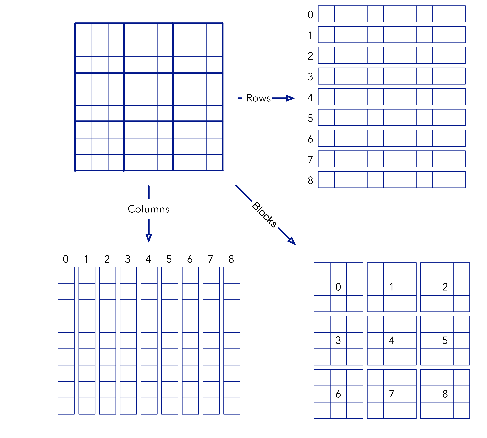
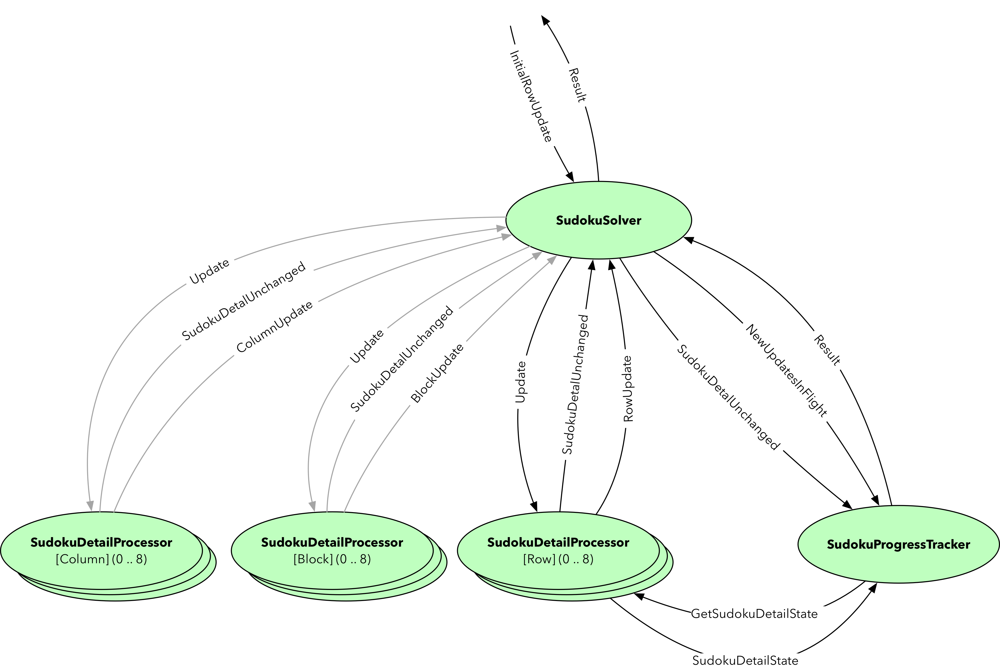

## Global Minimum

---

### Introduction

We implement a Sudoku solver using (Akka) actors.

None of the components in this implementation maintains mutable state. A such we are able to implement a solution that uses concurrency and that can exploit compute resources (multi-cpu/core/thread) when available i a straightforward manner.

The core idea is that a sudoku is composed of rows, columns and blocks that can be mapped independently to individual actors. Hence the core solver consists of a main actor and 27 "detail" actors.



After sending an initial update that contains the "known" cells to the main actor, these changes are sent to the appropriate (9) row detail actors. These apply an algorithm to calculate the consequences of the received update. Next
the changes, if any, are sent back to the main actor who then sends these changes to the column and block detail actors.

These actor repeat the process leading to more updates being
sent, etc...

Ultimately, the system converges to a stable state which is the Sudoku solution, unless the original start state is underspecified.

In a second step, an actor (SudokuProgressTracker) is added to
detect the reaching of the stable state followed by the collection
of the result from the row detail actors (as this is the more straightforward way to get it). After collecting this information,
the full result is sent back to the main actor who will forward it the the original requestor.

The actors and message flow are depicted here:



Note that the code also contains tests for the reduction algorithm (2 distinct reduction algorithms are utilised) and a few sample sudoku in the `sudokus` subfolder.

Run the solver from `sbt` as demonstrated below _(don't forget to select the project `exercise_003_detecting_global_minimum)`_.

The file `sudokus/dm171203-03.sudoku` is a text file that contains the sudoku puzzle:

```
6 | 2 |9 7
   |369|
  1| 4 |
---+---+---
 98|  5|
 2 |6  |3
   |   |  9
---+---+---
  2|8  |  1
   |  7| 6
 5 |   |
```

```
[ericloots@Eric-Loots-MBP] $ sbt
[info] Loading settings from plugins.sbt ...
[info] Loading project definition from /Users/ericloots/Trainingen/LightbendTraining/GlobalMinimum/project
[info] Loading settings from build.sbt ...
[info] Loading settings from build.sbt ...
[info] Loading settings from build.sbt ...
[info] Loading settings from build.sbt ...
[info] Loading settings from build.sbt ...
[info] Loading settings from build.sbt ...
[info] Set current project to base (in build file:/Users/ericloots/Trainingen/LightbendTraining/GlobalMinimum/)
[info] Set current project to exercise_000_initial_state (in build file:/Users/ericloots/Trainingen/LightbendTraining/GlobalMinimum/)
[info] sbt server started at local:///Users/ericloots/.sbt/1.0/server/bf2e10cf4903cb531195/sock
man [e] > global-mimimum > initial-state > project exercise_003_detecting_global_minimum
[info] Set current project to exercise_003_detecting_global_minimum (in build file:/Users/ericloots/Trainingen/LightbendTraining/GlobalMinimum/)
man [e] > global-mimimum > detecting-global-minimum-state > run sudokus/dm171203-03.sudoku
[info] Running globalminimum.sudoku.SudokuMain sudokus/dm171203-03.sudoku
18:21:40 INFO  [] - Slf4jLogger started
18:21:40 DEBUG [EventStream(akka://sudoku)] - logger log1-Slf4jLogger started
18:21:40 DEBUG [EventStream(akka://sudoku)] - Default Loggers started
Result ~~>
   Vector(Set(8), Set(6), Set(4), Set(5), Set(2), Set(1), Set(9), Set(3), Set(7))
   Vector(Set(2), Set(7), Set(5), Set(3), Set(6), Set(9), Set(1), Set(8), Set(4))
   Vector(Set(9), Set(3), Set(1), Set(7), Set(4), Set(8), Set(6), Set(2), Set(5))
   Vector(Set(3), Set(9), Set(8), Set(1), Set(7), Set(5), Set(2), Set(4), Set(6))
   Vector(Set(5), Set(2), Set(7), Set(6), Set(9), Set(4), Set(3), Set(1), Set(8))
   Vector(Set(4), Set(1), Set(6), Set(2), Set(8), Set(3), Set(7), Set(5), Set(9))
   Vector(Set(7), Set(4), Set(2), Set(8), Set(3), Set(6), Set(5), Set(9), Set(1))
   Vector(Set(1), Set(8), Set(3), Set(9), Set(5), Set(7), Set(4), Set(6), Set(2))
   Vector(Set(6), Set(5), Set(9), Set(4), Set(1), Set(2), Set(8), Set(7), Set(3))
Done !
18:21:40 DEBUG [EventStream] - shutting down: StandardOutLogger started
[success] Total time: 1 s, completed Dec 14, 2017 6:21:40 PM
man [e] > global-mimimum > detecting-global-minimum-state >
```


Todo:

- Add monitoring to analyse algorithm behaviour
- Integrate the sudoku solver actor into Akka Streams so
    that flow control (back-pressure) is added
- Add nice printing of Sudoku grid
- ...
  
